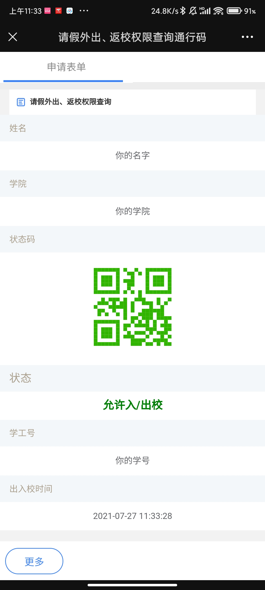

# fake-passport-bupt

真正的网页版北邮出入校通行证，自定义任何信息，与真实网页完全相同，随意检查。

每个请求均可以自定义`姓名`，`学院`，`学号`，`出入校类型` 或使用随机生成的身份信息。

> 若你打算使用本工具，请知悉：使用者将自行承担使用本工具产生的所有后果！
>
> 该软件“按原样”提供，不提供任何形式的明示或暗示的保证，包括但不限于适销性、特定用途的适用性和不侵权的保证。在任何情况下，无论是在合同诉讼、侵权行为或其他方面，作者或版权持有人均不对直接或间接产生于本软件、使用本软件的过程中或对本软件做其他处理产生的任何索赔、损害或其他后果承担任何责任。（译者（本人）不对中文译文的准确性做任何保证，任何信息请以原文为准，详见 LICENSE 文件或 MIT 许可协议。）
>
> THE SOFTWARE IS PROVIDED "AS IS", WITHOUT WARRANTY OF ANY KIND, EXPRESS OR IMPLIED, INCLUDING BUT NOT LIMITED TO THE WARRANTIES OF MERCHANTABILITY, FITNESS FOR A PARTICULAR PURPOSE AND NONINFRINGEMENT. IN NO EVENT SHALL THE AUTHORS OR COPYRIGHT HOLDERS BE LIABLE FOR ANY CLAIM, DAMAGES OR OTHER LIABILITY, WHETHER IN AN ACTION OF CONTRACT, TORT OR OTHERWISE, ARISING FROM, OUT OF OR IN CONNECTION WITH THE SOFTWARE OR THE USE OR OTHER DEALINGS IN THE SOFTWARE.

示例：

> 觉得有用可以点点 star 哈

## 使用方法

首先将 `.example.env` 复制一份为 `.env`，将 `config/example.config.json` 复制一份为 `config/config.json` 它们是配置文件，你可以根据需要修改内容

### 运行方法一：直接运行（使用`Node.js`）

1. 确保 `node` 已正常安装（版本需要`>= 14`），通过 `node --version` 检查是否安装成功

2. 进入本项目根目录，`npm install` 安装依赖

3. `chmod +x runner.sh; ./runner.sh start dev --verbose` 开始运行，你应该会看到控制台输出 `App listening at 10985`（`10985` 是默认端口）

4. 现在你可以在浏览器 `localhost:10985` 访问它。桌面端样式不对和字体不对是正常现象，因为学校官方网站也是这样的，真正的完全相同（笑😂，微信访问就正常了

5. 根据你的需要部署至你自己的服务器上（以便用手机移动网络访问），在服务器上运行时可以使用 `./runner.sh start dev --verbose --detach` 运行，方便在后台长期运行。（`./runner.sh stop dev` 来停止）

    > 如果你好奇那个 runner.sh 是个啥玩意，你可以在这里找到它 [charlie0129/server-app-runner](https://github.com/charlie0129/server-app-runner)

### 运行方法二：Docker 容器化

1. 确保安装了 `docker` 和 `docker-compose`
2. `docker-compose up --build --file docker-compose-general.yml --env-file .env` 来 build 并运行
    - 如果你的服务器上使用 `traefik` 反向代理，你可以使用默认的 docker-compose 配置，`docker-compose up --build `，记得在 `.env` 文件中的 `WEBSITE_URL` 说明你的域名和路由
3. 现在你可以在浏览器 `localhost:10985` 访问它。桌面端样式不对和字体不对是正常现象，因为学校官方网站也是这样的，真正的完全相同（笑😂，微信访问就正常了
4. 在服务器上部署时加上 `--detach` 参数即可在后台运行

### 开始使用

1. 建议部署在有公网 IP 服务器上，方便在外使用移动网络访问。以下所有网址均使用你自己服务器地址 or 域名
2. 参考下面的 API 说明，填好信息（你也可以不填，若 `config.json` 中 `isRandomIdentityEnabled` 设置为 `true` 或使用相关 API 开启随机信息生成后服务器会自动生成随机值，接下来跳至第 `6` 步）。在电脑浏览器（Chromium 内核）上打开你填好信息的URL（我们要把中文 escape 掉，不然微信不认）
3. 打开网页之后再复制一遍地址栏的URL，这时你的剪贴板里面会是 escape 过的 URL，它看起来像这样 `http://localhost:10985/?school=%E4%BD%A0%E7%9A%84%E5%AD%A6%E9%99%A2&type=%E5%85%A5/%E5%87%BA&id=%E4%BD%A0%E7%9A%84%E5%AD%A6%E5%8F%B7&name=%E4%BD%A0%E7%9A%84%E5%90%8D%E5%AD%97`
4. 把这串地址复制并发送给自己的手机微信，方便以后在手机上直接打开
5. 用同样的方法生成自己的出校和入校的 URL
6. 完事👏👏 现在你可以在手机微信里打开刚刚的 URL 获取出入校通行证了

## API

### 通行证页面 GET `/`

| URL Param | 含义                     | 默认值   |
| --------- | ------------------------ | -------- |
| name      | 你的名字                 | 随机姓名 |
| school    | 你的学院                 | 随机学院 |
| type      | 出校或入校，填 `出` 或 `入` | 入       |
| id        | 你的学号                 | 随机学号 |

最终你的 URL 看起来会是这样：`http://localhost:10985/?school=你的学院&type=出&id=你的学号&name=你的名字`

### 获取日志 GET `/logs`

> 需要鉴权，记得设置 `AUTH_USERNAME` 和 `AUTH_PASSWORD` 环境变量或在 `.env` 中配置用户名和密码

### 发送全局提醒 POST `/config/alert`

>  需要鉴权，记得设置 `AUTH_USERNAME` 和 `AUTH_PASSWORD` 环境变量或在 `.env` 中配置用户名和密码

Request body 使用 JSON

| JSON Property | Type   | 含义                 |
| ------------- | ------ | -------------------- |
| alert         | `string` | 用户能看到的提醒信息 |

### 删除全局提醒 DELETE `/config/alert`

>  需要鉴权，记得设置 `AUTH_USERNAME` 和 `AUTH_PASSWORD` 环境变量或在 `.env` 中配置用户名和密码

### 开启/关闭随机信息生成 PUT `/config/random-identity`

>  需要鉴权，记得设置 `AUTH_USERNAME` 和 `AUTH_PASSWORD` 环境变量或在 `.env` 中配置用户名和密码

Request body 使用 JSON

| JSON Property | Type   | 含义                 |
| ------------- | ------ | -------------------- |
| enabled       | `boolean` | 开启/关闭随机信息生成 |

### 开启/关闭匿名访问（不设置身份信息） PUT `/config/anonymous-access`

>  需要鉴权，记得设置 `AUTH_USERNAME` 和 `AUTH_PASSWORD` 环境变量或在 `.env` 中配置用户名和密码

Request body 使用 JSON

| JSON Property | Type   | 含义                 |
| ------------- | ------ | -------------------- |
| enabled       | `boolean` | 开启/关闭匿名访问 |

### 设置白名单 POST `/config/whitelist`

>  需要鉴权，记得设置 `AUTH_USERNAME` 和 `AUTH_PASSWORD` 环境变量或在 `.env` 中配置用户名和密码

Request body 使用 JSON

| JSON Property | Type   | 含义                 |
| ------------- | ------ | -------------------- |
| enabled       | `boolean` | 开启/关闭白名单 |
| whitelist       | `string[]` | 在白名单中的姓名（将覆盖原有的） |

### 添加白名单 PUT `/config/whitelist`

>  需要鉴权，记得设置 `AUTH_USERNAME` 和 `AUTH_PASSWORD` 环境变量或在 `.env` 中配置用户名和密码

Request body 使用 JSON

| JSON Property | Type   | 含义                 |
| ------------- | ------ | -------------------- |
| whitelist       | `string[]` | 在白名单中的姓名（将添加至原有的） |

### 获取配置信息 GET `/config`

>  需要鉴权，记得设置 `AUTH_USERNAME` 和 `AUTH_PASSWORD` 环境变量或在 `.env` 中配置用户名和密码

会获取全局提醒和随机信息生成的配置
